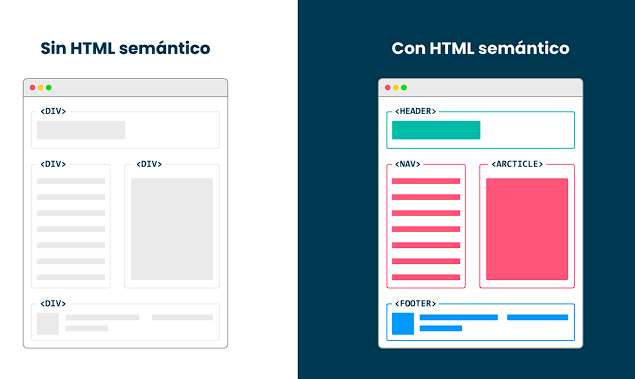
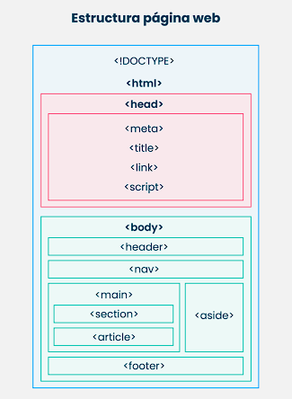

# ProgramacionWebDesdeCero

Programacion Web Desde Cero (HTML, CSS, Js) - 2023

***

## Paso #1:

Vamos a utilizar Visual Studio Code como editor de código.

[1]: https://code.visualstudio.com/

### Los requisitos mínimos para instalar Visual Studio Code son:

Requisitos:
------------------
1. 1.6 GHz de procesador, o más
2. 8 GB de RAM
3. Windows 10 u 11 (32-bit y 64-bit)
4. macOS - con la nueva versión de seguridad de Apple instalada 
5. Linux (Debian): Ubuntu Desktop 16.04, Debian 9
6. Linux (Red Hat): Red Hat Enterprise Linux 7, CentOS 7, Fedora 34

***

## Paso #2: Idea inicial

Piensa en una idea que deseas plasmar en un pagina web.

***

## Paso #3: Intorduccion a HTML 5

Crea un archivo index.html y genera la estructura básica de un documento HTML dentro del mismo. Esto significa que debe incluir las etiquetas:

```html
<!DOCTYPE html>
<html>
    <head>
        <title>Título del sitio Web</title>
    </head>
    <body>
    </body>
</html>
```

***

## Paso #4: Manipulando HTML!



La estructura HTML permite definir paginas web que sean mas legibles:



***

## Paso 5: CSS
¡Introducción a las hojas de estilo!

Permite cargar los estilo de la pagina Web.

### Selectores:

| Tipos de selectores| Descripcion Selectores|
| :-------- | --------:|
| ID | Identificador Unico de un elemento |
| Clase | Composicion de estilos sobre un elemento HTML y compartido |

#### Selector por ID:

Se utiliza para referenciar a aquellos atributos que esten marcados con el ID

```CSS
# nombreID {
    ....
}
```
#### Selector por clase:

Se utiliza para referenciar las clases de los componentes que esten marcados con la clase:

```CSS
.NombreClase {
    ....
}
```